# 📘 Módulo 01: Diseño Digital

```
::METADATA::
tipo: indice-modulo
modulo: 01-Diseno-Digital
prefijo: DD
subtemas: 7
actualizado: 2026-01-03
::END::
```

## Descripción del Módulo

Este módulo cubre los fundamentos del **Diseño Digital**, desde los sistemas numéricos básicos hasta circuitos secuenciales avanzados y memorias. Proporciona la base teórica necesaria para el diseño de sistemas digitales antes de pasar a la implementación en VHDL.

---

## 🗺️ Mapa de Subtemas

```mermaid
graph LR
    A[01-sistemas-numericos] --> B[02-algebra-booleana]
    B --> C[03-compuertas-logicas]
    C --> D[04-circuitos-combinacionales]
    D --> E[05-circuitos-secuenciales]
    E --> F[06-contadores-registros]
    F --> G[07-memorias]
    G --> H[Módulo VHDL]
    
    style A fill:#e1f5fe
    style B fill:#e1f5fe
    style C fill:#b3e5fc
    style D fill:#b3e5fc
    style E fill:#81d4fa
    style F fill:#81d4fa
    style G fill:#4fc3f7
```



---

## 📚 Índice de Subtemas

| # | Subtema | Descripción | Dificultad | Estado |
|---|---------|-------------|:----------:|:------:|
| 01 | [Sistemas Numéricos](01-01-sistemas-numericos/DD-01-Intro.md) | Bases numéricas, conversiones y complementos | ⭐ | 🔄 |
| 02 | [Álgebra Booleana](01-02-algebra-booleana/DD-02-Intro.md) | Operaciones lógicas, teoremas y simplificación | ⭐ | 🔄 |
| 03 | [Compuertas Lógicas](01-03-compuertas-logicas/DD-03-Intro.md) | AND, OR, NOT, NAND, NOR, XOR y familias lógicas | ⭐ | 🔄 |
| 04 | [Circuitos Combinacionales](01-04-circuitos-combinacionales/DD-04-Intro.md) | Multiplexores, decodificadores, sumadores | ⭐⭐ | 🔄 |
| 05 | [Circuitos Secuenciales](01-05-circuitos-secuenciales/DD-05-Intro.md) | Flip-flops, latches, máquinas de estado | ⭐⭐ | 🔄 |
| 06 | [Contadores y Registros](01-06-contadores-registros/DD-06-Intro.md) | Contadores síncronos/asíncronos, registros de desplazamiento | ⭐⭐ | 🔄 |
| 07 | [Memorias](01-07-memorias/DD-07-Intro.md) | RAM, ROM, Flash y lógica programable | ⭐⭐⭐ | 🔄 |

### Leyenda
- ⭐ Básico | ⭐⭐ Intermedio | ⭐⭐⭐ Avanzado
- ✅ Completo | 🔄 En desarrollo | ❌ Pendiente

---

## 🎯 Objetivos de Aprendizaje del Módulo

Al completar este módulo, el estudiante será capaz de:

1. **Manipular** diferentes sistemas de numeración y realizar conversiones
2. **Aplicar** los teoremas del álgebra booleana para simplificar expresiones
3. **Analizar** y **diseñar** circuitos combinacionales básicos
4. **Comprender** el funcionamiento de elementos de memoria (flip-flops)
5. **Diseñar** circuitos secuenciales síncronos
6. **Implementar** contadores y registros para aplicaciones específicas
7. **Seleccionar** el tipo de memoria adecuado para cada aplicación

---

## 📋 Prerrequisitos

- Conocimientos básicos de matemáticas (aritmética)
- Conceptos fundamentales de electricidad (opcional pero recomendado)
- Familiaridad con el uso de calculadora científica

---

## ⏱️ Tiempo Estimado

| Subtema | Teoría | Práctica | Total |
|---------|:------:|:--------:|:-----:|
| 01 - Sistemas Numéricos | 2h | 3h | 5h |
| 02 - Álgebra Booleana | 2h | 4h | 6h |
| 03 - Compuertas Lógicas | 2h | 2h | 4h |
| 04 - Circuitos Combinacionales | 3h | 4h | 7h |
| 05 - Circuitos Secuenciales | 3h | 4h | 7h |
| 06 - Contadores y Registros | 2h | 3h | 5h |
| 07 - Memorias | 2h | 2h | 4h |
| **TOTAL** | **16h** | **22h** | **38h** |

---

## 📖 Referencias Bibliográficas

Las referencias completas se encuentran en [00-META/bibliografia-general.md](../00-META/bibliografia-general.md).

| ID | Referencia | Uso Principal |
|----|------------|---------------|
| DD-REF-01 | Mano & Ciletti, 2018 | Texto principal |
| DD-REF-02 | Tocci et al., 2017 | Complemento práctico |
| DD-REF-03 | Floyd, 2015 | Ejercicios adicionales |

---

## 🔗 Navegación

| ⬅️ Anterior | 🏠 Inicio | ➡️ Siguiente |
|:-----------:|:---------:|:------------:|
| - | [README](../README.md) | [Módulo VHDL](../02-Diseno-Digital-con-VHDL/00-Index.md) |

---

## 📁 Estructura del Módulo

```
01-Diseno-Digital/
├── 00-Index.md                      ← Este archivo
├── 01-01-sistemas-numericos/
│   ├── manifest.json
│   ├── DD-01-Intro.md
│   ├── DD-01-Resumen-Formulas.md
│   ├── DD-01-directives.md
│   ├── theory/
│   ├── methods/
│   ├── problems/
│   ├── solutions/
│   ├── applications/
│   └── media/
├── 01-02-algebra-booleana/
│   └── ...
└── ... (7 subtemas)
```

---

> **Nota para IA:** Al trabajar en este módulo, respetar las directivas definidas en cada subtema (`DD-XX-directives.md`) y el contrato global en `00-META/ia-contract.md`.
