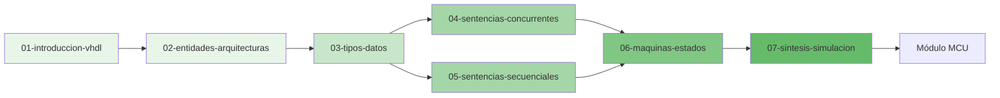

# 📘 Módulo 02: Diseño Digital con VHDL

```
::METADATA::
tipo: indice-modulo
modulo: 02-Diseno-Digital-con-VHDL
prefijo: VHDL
subtemas: 7
actualizado: 2026-01-03
::END::
```

## Descripción del Módulo

Este módulo introduce el lenguaje de descripción de hardware **VHDL** (VHSIC Hardware Description Language) para la implementación de sistemas digitales. Cubre desde la sintaxis básica hasta el diseño de máquinas de estado finito y técnicas de síntesis.

---

## 🗺️ Mapa de Subtemas



---

## 📚 Índice de Subtemas

| # | Subtema | Descripción | Dificultad | Estado |
|---|---------|-------------|:----------:|:------:|
| 01 | [Introducción a VHDL](02-01-introduccion-vhdl/VHDL-01-Intro.md) | Historia, flujo de diseño, herramientas | ⭐ | 🔄 |
| 02 | [Entidades y Arquitecturas](02-02-entidades-arquitecturas/VHDL-02-Intro.md) | Estructura básica, puertos, modos | ⭐ | 🔄 |
| 03 | [Tipos de Datos](02-03-tipos-datos/VHDL-03-Intro.md) | std_logic, vectores, enteros, enumerados | ⭐⭐ | 🔄 |
| 04 | [Sentencias Concurrentes](02-04-sentencias-concurrentes/VHDL-04-Intro.md) | Asignaciones, when-else, with-select, generate | ⭐⭐ | 🔄 |
| 05 | [Sentencias Secuenciales](02-05-sentencias-secuenciales/VHDL-05-Intro.md) | process, if-then-else, case, loops | ⭐⭐ | 🔄 |
| 06 | [Máquinas de Estados](02-06-maquinas-estados/VHDL-06-Intro.md) | FSM Moore, Mealy, codificación | ⭐⭐⭐ | 🔄 |
| 07 | [Síntesis y Simulación](02-07-sintesis-simulacion/VHDL-07-Intro.md) | Testbenches, constraints, timing | ⭐⭐⭐ | 🔄 |

### Leyenda
- ⭐ Básico | ⭐⭐ Intermedio | ⭐⭐⭐ Avanzado
- ✅ Completo | 🔄 En desarrollo | ❌ Pendiente

---

## 🎯 Objetivos de Aprendizaje del Módulo

Al completar este módulo, el estudiante será capaz de:

1. **Comprender** la sintaxis y semántica del lenguaje VHDL
2. **Diseñar** entidades con puertos de entrada/salida apropiados
3. **Implementar** circuitos combinacionales usando sentencias concurrentes
4. **Desarrollar** circuitos secuenciales usando procesos
5. **Modelar** máquinas de estados finitos (FSM)
6. **Crear** testbenches para verificación funcional
7. **Sintetizar** diseños para FPGAs

---

## 📋 Prerrequisitos

- ✅ Completar **Módulo 01: Diseño Digital** (especialmente 01-07)
- Conocimientos de lógica combinacional y secuencial
- Familiaridad con diagramas de tiempo
- Acceso a herramienta de simulación VHDL (GHDL, ModelSim, o Vivado)

---

## ⏱️ Tiempo Estimado

| Subtema | Teoría | Práctica | Total |
|---------|:------:|:--------:|:-----:|
| 01 - Introducción a VHDL | 1h | 2h | 3h |
| 02 - Entidades y Arquitecturas | 2h | 3h | 5h |
| 03 - Tipos de Datos | 2h | 3h | 5h |
| 04 - Sentencias Concurrentes | 2h | 4h | 6h |
| 05 - Sentencias Secuenciales | 3h | 5h | 8h |
| 06 - Máquinas de Estados | 3h | 5h | 8h |
| 07 - Síntesis y Simulación | 2h | 4h | 6h |
| **TOTAL** | **15h** | **26h** | **41h** |

---

## 📖 Referencias Bibliográficas

Las referencias completas se encuentran en [00-META/bibliografia-general.md](../00-META/bibliografia-general.md).

| ID | Referencia | Uso Principal |
|----|------------|---------------|
| VHDL-REF-01 | Ashenden, 2008 | Texto principal |
| VHDL-REF-02 | Pedroni, 2010 | Ejemplos prácticos |
| VHDL-REF-04 | IEEE 1076-2019 | Referencia oficial |
| VHDL-REF-05 | Chu, 2008 | Prototipos FPGA |

---

## 🔗 Navegación

| ⬅️ Anterior | 🏠 Inicio | ➡️ Siguiente |
|:-----------:|:---------:|:------------:|
| [Módulo DD](../01-Diseno-Digital/00-Index.md) | [README](../README.md) | [Módulo MCU](../03-Microcontroladores/00-Index.md) |

---

## 📁 Estructura del Módulo

```
02-Diseno-Digital-con-VHDL/
├── 00-Index.md                      ← Este archivo
├── 02-01-introduccion-vhdl/
│   ├── manifest.json
│   ├── VHDL-01-Intro.md
│   ├── VHDL-01-Resumen-Formulas.md
│   ├── VHDL-01-directives.md
│   ├── theory/
│   ├── methods/
│   ├── problems/
│   ├── solutions/
│   ├── applications/
│   └── media/
├── 02-02-entidades-arquitecturas/
│   └── ...
└── ... (7 subtemas)
```

---

## 💡 Consejos para el Estudio

1. **Practica constantemente:** VHDL se aprende escribiendo código
2. **Simula todo:** Usa testbenches antes de sintetizar
3. **Piensa en hardware:** VHDL describe circuitos, no programas
4. **Consulta la referencia IEEE:** Para casos de sintaxis avanzada

---

> **Nota para IA:** Al trabajar en este módulo, verificar que el código VHDL sea sintetizable y seguir las convenciones definidas en `VHDL-XX-directives.md`.
