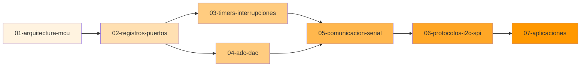

# 📘 Módulo 03: Microcontroladores

```
::METADATA::
tipo: indice-modulo
modulo: 03-Microcontroladores
prefijo: MCU
subtemas: 7
actualizado: 2026-01-03
::END::
```

## Descripción del Módulo

Este módulo cubre la programación y aplicación de **microcontroladores PIC**, desde la arquitectura interna hasta protocolos de comunicación avanzados. Enfocado en aplicaciones prácticas de sistemas embebidos.

---

## 🗺️ Mapa de Subtemas



---

## 📚 Índice de Subtemas

| # | Subtema | Descripción | Dificultad | Estado |
|---|---------|-------------|:----------:|:------:|
| 01 | [Arquitectura MCU](03-01-arquitectura-mcu/MCU-01-Intro.md) | CPU, memoria, periféricos, buses | ⭐ | 🔄 |
| 02 | [Registros y Puertos](03-02-registros-puertos/MCU-02-Intro.md) | GPIO, TRIS, PORT, LAT, configuración | ⭐ | 🔄 |
| 03 | [Timers e Interrupciones](03-03-timers-interrupciones/MCU-03-Intro.md) | Timer0/1/2, ISR, prioridades | ⭐⭐ | 🔄 |
| 04 | [ADC y DAC](03-04-adc-dac/MCU-04-Intro.md) | Conversión analógica-digital, PWM | ⭐⭐ | 🔄 |
| 05 | [Comunicación Serial](03-05-comunicacion-serial/MCU-05-Intro.md) | UART, RS-232, configuración baudios | ⭐⭐ | 🔄 |
| 06 | [Protocolos I2C/SPI](03-06-protocolos-i2c-spi/MCU-06-Intro.md) | MSSP, direccionamiento, timing | ⭐⭐⭐ | 🔄 |
| 07 | [Aplicaciones](03-07-aplicaciones/MCU-07-Intro.md) | Proyectos integradores, sensores, actuadores | ⭐⭐⭐ | 🔄 |

### Leyenda
- ⭐ Básico | ⭐⭐ Intermedio | ⭐⭐⭐ Avanzado
- ✅ Completo | 🔄 En desarrollo | ❌ Pendiente

---

## 🎯 Objetivos de Aprendizaje del Módulo

Al completar este módulo, el estudiante será capaz de:

1. **Comprender** la arquitectura interna de microcontroladores PIC
2. **Configurar** puertos de entrada/salida digital
3. **Programar** temporizadores para generar retardos precisos
4. **Implementar** rutinas de servicio de interrupción (ISR)
5. **Realizar** conversiones analógico-digitales
6. **Establecer** comunicación serial UART
7. **Implementar** protocolos I2C y SPI para periféricos externos
8. **Desarrollar** aplicaciones completas de sistemas embebidos

---

## 📋 Prerrequisitos

- ✅ Completar **Módulo 01: Diseño Digital** (especialmente 01-05 a 01-07)
- Conocimientos básicos de programación en C
- Familiaridad con electrónica básica (resistencias, LEDs, sensores)
- Acceso a MPLAB X IDE y compilador XC8
- Kit de desarrollo PIC (recomendado: PIC16F887)

---

## ⏱️ Tiempo Estimado

| Subtema | Teoría | Práctica | Total |
|---------|:------:|:--------:|:-----:|
| 01 - Arquitectura MCU | 2h | 1h | 3h |
| 02 - Registros y Puertos | 2h | 4h | 6h |
| 03 - Timers e Interrupciones | 3h | 5h | 8h |
| 04 - ADC y DAC | 2h | 4h | 6h |
| 05 - Comunicación Serial | 2h | 4h | 6h |
| 06 - Protocolos I2C/SPI | 3h | 5h | 8h |
| 07 - Aplicaciones | 2h | 8h | 10h |
| **TOTAL** | **16h** | **31h** | **47h** |

---

## 📖 Referencias Bibliográficas

Las referencias completas se encuentran en [00-META/bibliografia-general.md](../00-META/bibliografia-general.md).

| ID | Referencia | Uso Principal |
|----|------------|---------------|
| MCU-REF-01 | Mazidi et al., 2017 | Texto principal |
| MCU-REF-03 | Wilmshurst, 2010 | Diseño de sistemas |
| MCU-REF-04 | DS41291G | Datasheet PIC16F887 |
| MCU-REF-05 | MPLAB XC8 Guide | Referencia compilador |

---

## 🔗 Navegación

| ⬅️ Anterior | 🏠 Inicio | ➡️ Siguiente |
|:-----------:|:---------:|:------------:|
| [Módulo VHDL](../02-Diseno-Digital-con-VHDL/00-Index.md) | [README](../README.md) | - |

---

## 📁 Estructura del Módulo

```
03-Microcontroladores/
├── 00-Index.md                      ← Este archivo
├── 03-01-arquitectura-mcu/
│   ├── manifest.json
│   ├── MCU-01-Intro.md
│   ├── MCU-01-Resumen-Formulas.md
│   ├── MCU-01-directives.md
│   ├── theory/
│   ├── methods/
│   ├── problems/
│   ├── solutions/
│   ├── applications/
│   └── media/
├── 03-02-registros-puertos/
│   └── ...
└── ... (7 subtemas)
```

---

## 🔧 Herramientas Recomendadas

| Herramienta | Propósito | Enlace |
|-------------|-----------|--------|
| MPLAB X IDE | Entorno de desarrollo | [microchip.com](https://www.microchip.com/mplab/mplab-x-ide) |
| XC8 Compiler | Compilador C | Incluido en MPLAB |
| Proteus | Simulación de circuitos | [labcenter.com](https://www.labcenter.com/) |
| PICkit 3/4 | Programador hardware | Microchip |

---

## 💡 Consejos para el Estudio

1. **Consulta el datasheet:** Es tu mejor amigo para configurar registros
2. **Simula antes de quemar:** Usa Proteus para validar el diseño
3. **Comienza simple:** LED → Timer → UART → I2C (progresión natural)
4. **Documenta tu código:** Los registros del PIC son crípticos, comenta todo

---

> **Nota para IA:** Al trabajar en este módulo, verificar compatibilidad con PIC16F887 y seguir las convenciones de código C definidas en `MCU-XX-directives.md`. Todo código debe ser compilable con XC8.
