<!--
::METADATA::
type: module-index
topic_id: repo-root
file_id: readme-principal
status: draft
audience: both
last_updated: 2026-01-02
difficulty: 1
tags: [indice, navegacion, skill-tree]
search_keywords: "diseño digital, vhdl, microcontroladores, fpga, indice"
-->

# DISEÑO DIGITAL

Repositorio educativo para las materias de **Diseño Digital**, **Diseño Digital con VHDL** y **Microcontroladores**.

## Índice de Navegación

- [Skill Tree (Mapa de Competencias)](#skill-tree)
- [Módulos](#módulos)
- [Recursos](#recursos)
- [Índice AI-Friendly](#índice-ai-friendly)

---

## Skill Tree

```mermaid
flowchart TB
    subgraph DD["01 - DISEÑO DIGITAL"]
        DD01[Sistemas Numéricos]
        DD02[Álgebra Booleana]
        DD03[Compuertas Lógicas]
        DD04[Circuitos Combinacionales]
        DD05[Circuitos Secuenciales]
        DD06[Contadores y Registros]
        DD07[Memorias]
        
        DD01 --> DD02
        DD02 --> DD03
        DD03 --> DD04
        DD04 --> DD05
        DD05 --> DD06
        DD06 --> DD07
    end

    subgraph VHDL["02 - VHDL"]
        VH01[Introducción a VHDL]
        VH02[Entidades y Arquitecturas]
        VH03[Tipos de Datos]
        VH04[Sentencias Concurrentes]
        VH05[Sentencias Secuenciales]
        VH06[Máquinas de Estados]
        VH07[Síntesis y Simulación]
        
        VH01 --> VH02
        VH02 --> VH03
        VH03 --> VH04
        VH04 --> VH05
        VH05 --> VH06
        VH06 --> VH07
    end

    subgraph MCU["03 - MICROCONTROLADORES"]
        MC01[Arquitectura de MCU]
        MC02[Registros y Puertos]
        MC03[Timers e Interrupciones]
        MC04[ADC y DAC]
        MC05[Comunicación Serial]
        MC06[Protocolos I2C/SPI]
        MC07[Aplicaciones]
        
        MC01 --> MC02
        MC02 --> MC03
        MC03 --> MC04
        MC04 --> MC05
        MC05 --> MC06
        MC06 --> MC07
    end

    DD --> VHDL
    DD --> MCU
```



---

## Módulos

### 01 - Diseño Digital

| Subtema | Descripción | Dificultad | Estado |
|---------|-------------|------------|--------|
| [01-01 Sistemas Numéricos](./01-Diseno-Digital/01-01-sistemas-numericos/) | Binario, octal, hexadecimal, conversiones | 1 | draft |
| [01-02 Álgebra Booleana](./01-Diseno-Digital/01-02-algebra-booleana/) | Operaciones, teoremas, simplificación | 1 | draft |
| [01-03 Compuertas Lógicas](./01-Diseno-Digital/01-03-compuertas-logicas/) | AND, OR, NOT, NAND, NOR, XOR | 1 | draft |
| [01-04 Circuitos Combinacionales](./01-Diseno-Digital/01-04-circuitos-combinacionales/) | Multiplexores, decodificadores, sumadores | 2 | draft |
| [01-05 Circuitos Secuenciales](./01-Diseno-Digital/01-05-circuitos-secuenciales/) | Flip-flops, latches, análisis temporal | 2 | draft |
| [01-06 Contadores y Registros](./01-Diseno-Digital/01-06-contadores-registros/) | Contadores, registros de desplazamiento | 2 | draft |
| [01-07 Memorias](./01-Diseno-Digital/01-07-memorias/) | RAM, ROM, tipos de memoria | 2 | draft |

### 02 - Diseño Digital con VHDL

| Subtema | Descripción | Dificultad | Estado |
|---------|-------------|------------|--------|
| [02-01 Introducción a VHDL](./02-Diseno-Digital-con-VHDL/02-01-introduccion-vhdl/) | Historia, flujo de diseño, herramientas | 1 | draft |
| [02-02 Entidades y Arquitecturas](./02-Diseno-Digital-con-VHDL/02-02-entidades-arquitecturas/) | Estructura básica de diseños VHDL | 2 | draft |
| [02-03 Tipos de Datos](./02-Diseno-Digital-con-VHDL/02-03-tipos-datos/) | std_logic, vectores, tipos definidos | 2 | draft |
| [02-04 Sentencias Concurrentes](./02-Diseno-Digital-con-VHDL/02-04-sentencias-concurrentes/) | Asignaciones, with-select, when-else | 2 | draft |
| [02-05 Sentencias Secuenciales](./02-Diseno-Digital-con-VHDL/02-05-sentencias-secuenciales/) | Procesos, if-then-else, case | 2 | draft |
| [02-06 Máquinas de Estados](./02-Diseno-Digital-con-VHDL/02-06-maquinas-estados/) | FSM Moore y Mealy, diseño e implementación | 3 | draft |
| [02-07 Síntesis y Simulación](./02-Diseno-Digital-con-VHDL/02-07-sintesis-simulacion/) | Testbenches, simulación, síntesis FPGA | 3 | draft |

### 03 - Microcontroladores

| Subtema | Descripción | Dificultad | Estado |
|---------|-------------|------------|--------|
| [03-01 Arquitectura MCU](./03-Microcontroladores/03-01-arquitectura-mcu/) | Estructura interna, CPU, memoria, buses | 1 | draft |
| [03-02 Registros y Puertos](./03-Microcontroladores/03-02-registros-puertos/) | GPIO, configuración de puertos | 2 | draft |
| [03-03 Timers e Interrupciones](./03-Microcontroladores/03-03-timers-interrupciones/) | Temporizadores, manejo de interrupciones | 2 | draft |
| [03-04 ADC y DAC](./03-Microcontroladores/03-04-adc-dac/) | Conversión analógico-digital y viceversa | 2 | draft |
| [03-05 Comunicación Serial](./03-Microcontroladores/03-05-comunicacion-serial/) | UART, RS-232, comunicación asíncrona | 2 | draft |
| [03-06 Protocolos I2C/SPI](./03-Microcontroladores/03-06-protocolos-i2c-spi/) | Comunicación síncrona, maestro-esclavo | 3 | draft |
| [03-07 Aplicaciones](./03-Microcontroladores/03-07-aplicaciones/) | Proyectos integradores | 3 | draft |

---

## Recursos

- [Glosario de Términos](./GLOSSARY/README.md)
- [Wiki del Repositorio](./WIKI/README.md)
- [Plantillas de Metadatos](./00-META/templates/)

---

## Índice AI-Friendly

Este índice permite consultas automatizadas y navegación por IA:

```json
{
  "repository": "DISEÑO DIGITAL",
  "version": "1.0.0",
  "last_updated": "2026-01-02",
  "modules": [
    {
      "id": "01-diseno-digital",
      "path": "./01-Diseno-Digital/",
      "topic": "Diseño Digital",
      "difficulty": "básico-intermedio",
      "tags": ["digital", "combinacional", "secuencial", "fundamentos"]
    },
    {
      "id": "02-vhdl",
      "path": "./02-Diseno-Digital-con-VHDL/",
      "topic": "VHDL",
      "difficulty": "intermedio-avanzado",
      "tags": ["vhdl", "hdl", "fpga", "sintesis"]
    },
    {
      "id": "03-microcontroladores",
      "path": "./03-Microcontroladores/",
      "topic": "Microcontroladores",
      "difficulty": "intermedio-avanzado",
      "tags": ["mcu", "pic", "embedded", "programacion"]
    }
  ],
  "subtopics": [
    {"id": "01-01", "path": "./01-Diseno-Digital/01-01-sistemas-numericos/", "topic": "Sistemas Numéricos", "difficulty": 1, "tags": ["binario", "conversion", "numeracion"]},
    {"id": "01-02", "path": "./01-Diseno-Digital/01-02-algebra-booleana/", "topic": "Álgebra Booleana", "difficulty": 1, "tags": ["boole", "logica", "simplificacion"]},
    {"id": "01-03", "path": "./01-Diseno-Digital/01-03-compuertas-logicas/", "topic": "Compuertas Lógicas", "difficulty": 1, "tags": ["compuertas", "and", "or", "nand"]},
    {"id": "01-04", "path": "./01-Diseno-Digital/01-04-circuitos-combinacionales/", "topic": "Circuitos Combinacionales", "difficulty": 2, "tags": ["mux", "demux", "sumador"]},
    {"id": "01-05", "path": "./01-Diseno-Digital/01-05-circuitos-secuenciales/", "topic": "Circuitos Secuenciales", "difficulty": 2, "tags": ["flipflop", "latch", "sincronico"]},
    {"id": "01-06", "path": "./01-Diseno-Digital/01-06-contadores-registros/", "topic": "Contadores y Registros", "difficulty": 2, "tags": ["contador", "registro", "shift"]},
    {"id": "01-07", "path": "./01-Diseno-Digital/01-07-memorias/", "topic": "Memorias", "difficulty": 2, "tags": ["ram", "rom", "memoria"]},
    {"id": "02-01", "path": "./02-Diseno-Digital-con-VHDL/02-01-introduccion-vhdl/", "topic": "Introducción a VHDL", "difficulty": 1, "tags": ["vhdl", "introduccion", "hdl"]},
    {"id": "02-02", "path": "./02-Diseno-Digital-con-VHDL/02-02-entidades-arquitecturas/", "topic": "Entidades y Arquitecturas", "difficulty": 2, "tags": ["entidad", "arquitectura", "estructura"]},
    {"id": "02-03", "path": "./02-Diseno-Digital-con-VHDL/02-03-tipos-datos/", "topic": "Tipos de Datos", "difficulty": 2, "tags": ["std_logic", "tipos", "vectores"]},
    {"id": "02-04", "path": "./02-Diseno-Digital-con-VHDL/02-04-sentencias-concurrentes/", "topic": "Sentencias Concurrentes", "difficulty": 2, "tags": ["concurrente", "when", "select"]},
    {"id": "02-05", "path": "./02-Diseno-Digital-con-VHDL/02-05-sentencias-secuenciales/", "topic": "Sentencias Secuenciales", "difficulty": 2, "tags": ["proceso", "if", "case"]},
    {"id": "02-06", "path": "./02-Diseno-Digital-con-VHDL/02-06-maquinas-estados/", "topic": "Máquinas de Estados", "difficulty": 3, "tags": ["fsm", "moore", "mealy"]},
    {"id": "02-07", "path": "./02-Diseno-Digital-con-VHDL/02-07-sintesis-simulacion/", "topic": "Síntesis y Simulación", "difficulty": 3, "tags": ["testbench", "sintesis", "fpga"]},
    {"id": "03-01", "path": "./03-Microcontroladores/03-01-arquitectura-mcu/", "topic": "Arquitectura MCU", "difficulty": 1, "tags": ["arquitectura", "cpu", "memoria"]},
    {"id": "03-02", "path": "./03-Microcontroladores/03-02-registros-puertos/", "topic": "Registros y Puertos", "difficulty": 2, "tags": ["gpio", "puerto", "registro"]},
    {"id": "03-03", "path": "./03-Microcontroladores/03-03-timers-interrupciones/", "topic": "Timers e Interrupciones", "difficulty": 2, "tags": ["timer", "interrupcion", "isr"]},
    {"id": "03-04", "path": "./03-Microcontroladores/03-04-adc-dac/", "topic": "ADC y DAC", "difficulty": 2, "tags": ["adc", "dac", "conversion"]},
    {"id": "03-05", "path": "./03-Microcontroladores/03-05-comunicacion-serial/", "topic": "Comunicación Serial", "difficulty": 2, "tags": ["uart", "serial", "rs232"]},
    {"id": "03-06", "path": "./03-Microcontroladores/03-06-protocolos-i2c-spi/", "topic": "Protocolos I2C/SPI", "difficulty": 3, "tags": ["i2c", "spi", "protocolo"]},
    {"id": "03-07", "path": "./03-Microcontroladores/03-07-aplicaciones/", "topic": "Aplicaciones", "difficulty": 3, "tags": ["proyecto", "aplicacion", "integrador"]}
  ]
}
```

---

## Ejemplo de Consulta Contextual

Para consultar contenido usando IA, utiliza el siguiente formato:

```
Buscar en DISEÑO DIGITAL:
- Módulo: 02-vhdl
- Subtema: maquinas de estados
- Tipo: theory
- Tags: fsm, moore

Consulta: ¿Cómo implementar una máquina de estados Moore en VHDL?
```

---

## Estructura del Repositorio

```
DISEÑO DIGITAL/
├── README.md                      # Este archivo
├── GLOSSARY/                      # Glosario de términos
├── WIKI/                          # Documentación complementaria
├── 00-META/                       # Metadatos y plantillas
│   ├── templates/                 # Plantillas de archivos
│   └── tooling/                   # Herramientas auxiliares
├── 01-Diseno-Digital/             # Módulo 1: Diseño Digital
├── 02-Diseno-Digital-con-VHDL/    # Módulo 2: VHDL
├── 03-Microcontroladores/         # Módulo 3: Microcontroladores
├── ci/                            # Workflows de CI
└── scripts/                       # Scripts de validación
```

---

## Licencia

Este material es de uso educativo. Consultar archivo LICENSE para detalles.
