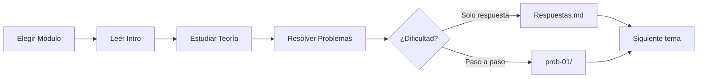

# 📚 WIKI INDEX - Repositorio de Diseño Digital

```
::METADATA::
tipo: indice-wiki
repositorio: diseño-digital-github
actualizado: 2026-01-03
version: 1.0
::END::
```

> 🏠 **Navegación:** [README Principal](README.md) | [Glosario](GLOSSARY/README.md)

---

## 🎯 Propósito de este Índice

Este archivo centraliza el acceso a todos los recursos del repositorio, organizado por:
1. **Módulos de contenido** - Material de aprendizaje estructurado
2. **Recursos transversales** - Documentación, herramientas y referencias
3. **Guías de uso** - Cómo navegar y contribuir al repositorio

---

## 📖 Módulos de Contenido

### 1️⃣ Diseño Digital (DD)

| # | Subtema | Intro | Teoría | Problemas | Soluciones |
|:-:|---------|:-----:|:------:|:---------:|:----------:|
| 01 | Sistemas Numéricos | [📘](01-Diseno-Digital/01-01-sistemas-numericos/DD-01-Intro.md) | [📗](01-Diseno-Digital/01-01-sistemas-numericos/theory/) | [📙](01-Diseno-Digital/01-01-sistemas-numericos/problems/) | [📕](01-Diseno-Digital/01-01-sistemas-numericos/solutions/) |
| 02 | Álgebra Booleana | [📘](01-Diseno-Digital/01-02-algebra-booleana/DD-02-Intro.md) | [📗](01-Diseno-Digital/01-02-algebra-booleana/theory/) | [📙](01-Diseno-Digital/01-02-algebra-booleana/problems/) | [📕](01-Diseno-Digital/01-02-algebra-booleana/solutions/) |
| 03 | Compuertas Lógicas | [📘](01-Diseno-Digital/01-03-compuertas-logicas/DD-03-Intro.md) | [📗](01-Diseno-Digital/01-03-compuertas-logicas/theory/) | [📙](01-Diseno-Digital/01-03-compuertas-logicas/problems/) | [📕](01-Diseno-Digital/01-03-compuertas-logicas/solutions/) |
| 04 | Circuitos Combinacionales | [📘](01-Diseno-Digital/01-04-circuitos-combinacionales/DD-04-Intro.md) | [📗](01-Diseno-Digital/01-04-circuitos-combinacionales/theory/) | [📙](01-Diseno-Digital/01-04-circuitos-combinacionales/problems/) | [📕](01-Diseno-Digital/01-04-circuitos-combinacionales/solutions/) |
| 05 | Circuitos Secuenciales | [📘](01-Diseno-Digital/01-05-circuitos-secuenciales/DD-05-Intro.md) | [📗](01-Diseno-Digital/01-05-circuitos-secuenciales/theory/) | [📙](01-Diseno-Digital/01-05-circuitos-secuenciales/problems/) | [📕](01-Diseno-Digital/01-05-circuitos-secuenciales/solutions/) |
| 06 | Contadores y Registros | [📘](01-Diseno-Digital/01-06-contadores-registros/DD-06-Intro.md) | [📗](01-Diseno-Digital/01-06-contadores-registros/theory/) | [📙](01-Diseno-Digital/01-06-contadores-registros/problems/) | [📕](01-Diseno-Digital/01-06-contadores-registros/solutions/) |
| 07 | Memorias | [📘](01-Diseno-Digital/01-07-memorias/DD-07-Intro.md) | [📗](01-Diseno-Digital/01-07-memorias/theory/) | [📙](01-Diseno-Digital/01-07-memorias/problems/) | [📕](01-Diseno-Digital/01-07-memorias/solutions/) |

🔗 **Índice del módulo:** [01-Diseno-Digital/00-Index.md](01-Diseno-Digital/00-Index.md)

---

### 2️⃣ Diseño Digital con VHDL

| # | Subtema | Intro | Teoría | Problemas | Soluciones |
|:-:|---------|:-----:|:------:|:---------:|:----------:|
| 01 | Introducción a VHDL | [📘](02-Diseno-Digital-con-VHDL/02-01-introduccion-vhdl/VHDL-01-Intro.md) | [📗](02-Diseno-Digital-con-VHDL/02-01-introduccion-vhdl/theory/) | [📙](02-Diseno-Digital-con-VHDL/02-01-introduccion-vhdl/problems/) | [📕](02-Diseno-Digital-con-VHDL/02-01-introduccion-vhdl/solutions/) |
| 02 | Entidades y Arquitecturas | [📘](02-Diseno-Digital-con-VHDL/02-02-entidades-arquitecturas/VHDL-02-Intro.md) | [📗](02-Diseno-Digital-con-VHDL/02-02-entidades-arquitecturas/theory/) | [📙](02-Diseno-Digital-con-VHDL/02-02-entidades-arquitecturas/problems/) | [📕](02-Diseno-Digital-con-VHDL/02-02-entidades-arquitecturas/solutions/) |
| 03 | Tipos de Datos | [📘](02-Diseno-Digital-con-VHDL/02-03-tipos-datos/VHDL-03-Intro.md) | [📗](02-Diseno-Digital-con-VHDL/02-03-tipos-datos/theory/) | [📙](02-Diseno-Digital-con-VHDL/02-03-tipos-datos/problems/) | [📕](02-Diseno-Digital-con-VHDL/02-03-tipos-datos/solutions/) |
| 04 | Sentencias Concurrentes | [📘](02-Diseno-Digital-con-VHDL/02-04-sentencias-concurrentes/VHDL-04-Intro.md) | [📗](02-Diseno-Digital-con-VHDL/02-04-sentencias-concurrentes/theory/) | [📙](02-Diseno-Digital-con-VHDL/02-04-sentencias-concurrentes/problems/) | [📕](02-Diseno-Digital-con-VHDL/02-04-sentencias-concurrentes/solutions/) |
| 05 | Sentencias Secuenciales | [📘](02-Diseno-Digital-con-VHDL/02-05-sentencias-secuenciales/VHDL-05-Intro.md) | [📗](02-Diseno-Digital-con-VHDL/02-05-sentencias-secuenciales/theory/) | [📙](02-Diseno-Digital-con-VHDL/02-05-sentencias-secuenciales/problems/) | [📕](02-Diseno-Digital-con-VHDL/02-05-sentencias-secuenciales/solutions/) |
| 06 | Máquinas de Estados | [📘](02-Diseno-Digital-con-VHDL/02-06-maquinas-estados/VHDL-06-Intro.md) | [📗](02-Diseno-Digital-con-VHDL/02-06-maquinas-estados/theory/) | [📙](02-Diseno-Digital-con-VHDL/02-06-maquinas-estados/problems/) | [📕](02-Diseno-Digital-con-VHDL/02-06-maquinas-estados/solutions/) |
| 07 | Síntesis y Simulación | [📘](02-Diseno-Digital-con-VHDL/02-07-sintesis-simulacion/VHDL-07-Intro.md) | [📗](02-Diseno-Digital-con-VHDL/02-07-sintesis-simulacion/theory/) | [📙](02-Diseno-Digital-con-VHDL/02-07-sintesis-simulacion/problems/) | [📕](02-Diseno-Digital-con-VHDL/02-07-sintesis-simulacion/solutions/) |

🔗 **Índice del módulo:** [02-Diseno-Digital-con-VHDL/00-Index.md](02-Diseno-Digital-con-VHDL/00-Index.md)

---

### 3️⃣ Microcontroladores (MCU)

| # | Subtema | Intro | Teoría | Problemas | Soluciones |
|:-:|---------|:-----:|:------:|:---------:|:----------:|
| 01 | Arquitectura MCU | [📘](03-Microcontroladores/03-01-arquitectura-mcu/MCU-01-Intro.md) | [📗](03-Microcontroladores/03-01-arquitectura-mcu/theory/) | [📙](03-Microcontroladores/03-01-arquitectura-mcu/problems/) | [📕](03-Microcontroladores/03-01-arquitectura-mcu/solutions/) |
| 02 | Registros y Puertos | [📘](03-Microcontroladores/03-02-registros-puertos/MCU-02-Intro.md) | [📗](03-Microcontroladores/03-02-registros-puertos/theory/) | [📙](03-Microcontroladores/03-02-registros-puertos/problems/) | [📕](03-Microcontroladores/03-02-registros-puertos/solutions/) |
| 03 | Timers e Interrupciones | [📘](03-Microcontroladores/03-03-timers-interrupciones/MCU-03-Intro.md) | [📗](03-Microcontroladores/03-03-timers-interrupciones/theory/) | [📙](03-Microcontroladores/03-03-timers-interrupciones/problems/) | [📕](03-Microcontroladores/03-03-timers-interrupciones/solutions/) |
| 04 | ADC y DAC | [📘](03-Microcontroladores/03-04-adc-dac/MCU-04-Intro.md) | [📗](03-Microcontroladores/03-04-adc-dac/theory/) | [📙](03-Microcontroladores/03-04-adc-dac/problems/) | [📕](03-Microcontroladores/03-04-adc-dac/solutions/) |
| 05 | Comunicación Serial | [📘](03-Microcontroladores/03-05-comunicacion-serial/MCU-05-Intro.md) | [📗](03-Microcontroladores/03-05-comunicacion-serial/theory/) | [📙](03-Microcontroladores/03-05-comunicacion-serial/problems/) | [📕](03-Microcontroladores/03-05-comunicacion-serial/solutions/) |
| 06 | Protocolos I2C/SPI | [📘](03-Microcontroladores/03-06-protocolos-i2c-spi/MCU-06-Intro.md) | [📗](03-Microcontroladores/03-06-protocolos-i2c-spi/theory/) | [📙](03-Microcontroladores/03-06-protocolos-i2c-spi/problems/) | [📕](03-Microcontroladores/03-06-protocolos-i2c-spi/solutions/) |
| 07 | Aplicaciones | [📘](03-Microcontroladores/03-07-aplicaciones/MCU-07-Intro.md) | [📗](03-Microcontroladores/03-07-aplicaciones/theory/) | [📙](03-Microcontroladores/03-07-aplicaciones/problems/) | [📕](03-Microcontroladores/03-07-aplicaciones/solutions/) |

🔗 **Índice del módulo:** [03-Microcontroladores/00-Index.md](03-Microcontroladores/00-Index.md)

---

## 🛠️ Recursos Transversales

### Documentación META

| Recurso | Descripción | Enlace |
|---------|-------------|--------|
| 📋 Directivas IA | Instrucciones para asistentes AI | [ai-directives.md](00-META/ai-directives.md) |
| 📚 Bibliografía | Referencias por módulo | [bibliografia-general.md](00-META/bibliografia-general.md) |
| 🏷️ Nomenclatura | Convenciones de nombres | [nomenclatura-estandar.md](00-META/nomenclatura-estandar.md) |
| 📝 Notación | Símbolos y fórmulas | [notation-cheatsheet.md](00-META/notation-cheatsheet.md) |
| 📖 Guía de Estudio | Estrategias de aprendizaje | [study-guide.md](00-META/study-guide.md) |
| 🎯 Prompts | Prompts para estudiantes | [prompts-for-students.md](00-META/prompts-for-students.md) |
| ✅ Tests | Validación del repositorio | [repo-tests.md](00-META/repo-tests.md) |

### Plantillas

| Plantilla | Uso | Enlace |
|-----------|-----|--------|
| Directivas | Nueva carpeta de subtema | [directives.template.md](00-META/templates/directives.template.md) |
| Manifest | Configuración de subtema | [manifest.template.json](00-META/templates/manifest.template.json) |
| Metadata | Encabezado de archivo | [metadata-header.template.md](00-META/templates/metadata-header.template.md) |

### Herramientas

| Herramienta | Función | Enlace |
|-------------|---------|--------|
| 🔧 Validador | Verificar estructura | [validate_repo.py](00-META/tools/validate_repo.py) |
| 🔗 Link KB | Enlazar base de conocimiento | [link_knowledge_base.py](00-META/tools/link_knowledge_base.py) |
| 📁 Fix Names | Corregir manifests | [fix_manifests_and_names.py](00-META/tools/fix_manifests_and_names.py) |

---

## 📊 Glosario

| Sección | Descripción | Enlace |
|---------|-------------|--------|
| 🔤 Principal | Términos generales | [GLOSSARY/README.md](GLOSSARY/README.md) |

---

## 🧭 Guías de Navegación

### Para Estudiantes



### Ruta Sugerida por Nivel

| Nivel | Módulos | Enfoque |
|-------|---------|---------|
| 🟢 Básico | DD-01 a DD-03 | Fundamentos |
| 🟡 Intermedio | DD-04 a DD-07 | Diseño |
| 🔵 Avanzado | VHDL-01 a VHDL-07 | HDL |
| 🟣 Aplicado | MCU-01 a MCU-07 | Implementación |

---

## 📈 Estado del Repositorio

### Progreso por Módulo

| Módulo | Teoría | Problemas | Soluciones | Aplicaciones |
|--------|:------:|:---------:|:----------:|:------------:|
| 01-Diseño Digital | ✅ | ✅ | ✅ | ✅ |
| 02-VHDL | ✅ | ✅ | ✅ | ⚠️ |
| 03-Microcontroladores | ✅ | ✅ | ✅ | ⚠️ |

**Leyenda:** ✅ Completo | ⚠️ Parcial | ❌ Pendiente

### Recursos Transversales

| Recurso | Estado |
|---------|:------:|
| GLOSSARY | ✅ Expandido (100+ términos) |
| Bibliografía | ✅ |
| WIKI_INDEX | ✅ |
| Herramientas | ✅ |

---

## 🔄 Historial de Actualizaciones

| Fecha | Cambio | Archivos Afectados |
|-------|--------|-------------------|
| 2026-01-03 | Creación inicial WIKI_INDEX | Este archivo |
| 2026-01-03 | Sistema 3 niveles soluciones DD | 14 archivos |
| 2026-01-03 | Bibliografía general | 1 archivo |
| 2026-01-03 | Índices de módulo | 3 archivos |
| 2026-01-03 | Soluciones VHDL | 10 archivos |
| 2026-01-03 | Soluciones MCU | 8 archivos |
| 2026-01-03 | Expansión GLOSSARY A-Z | 1 archivo |
| 2026-01-03 | Aplicaciones DD-01 a DD-07 | 7 archivos |
| 2026-01-03 | Aplicaciones VHDL/MCU | 4 archivos |

---

## 📞 Contribución

Para contribuir al repositorio:

1. Revisar [TEMPLATE_GUIA_NUEVO_REPOSITORIO.md](TEMPLATE_GUIA_NUEVO_REPOSITORIO.md)
2. Seguir convenciones en [nomenclatura-estandar.md](00-META/nomenclatura-estandar.md)
3. Validar con [validate_repo.py](00-META/tools/validate_repo.py)
4. Crear Pull Request con descripción detallada

---

> 📌 **Última actualización:** 2026-01-03  
> 📧 **Mantenedor:** [Tu nombre o equipo]
